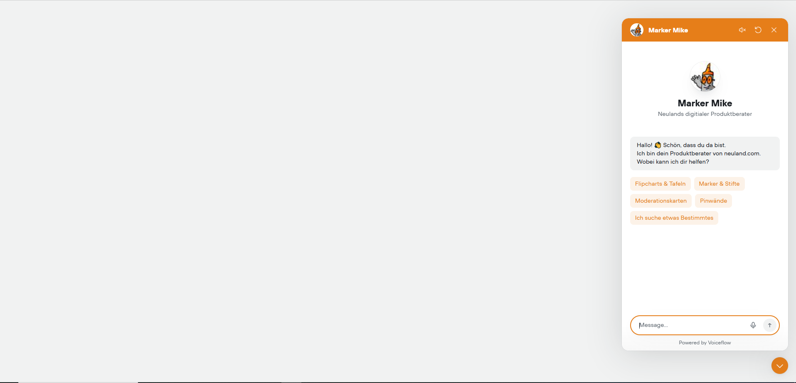
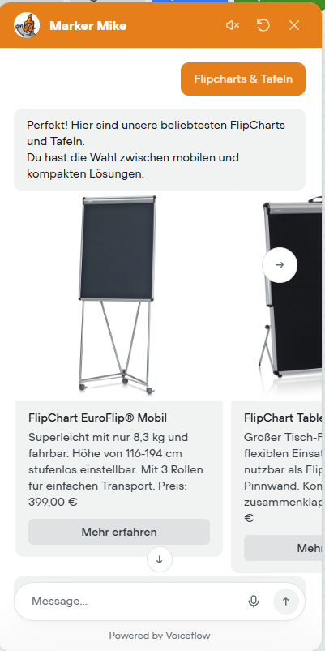
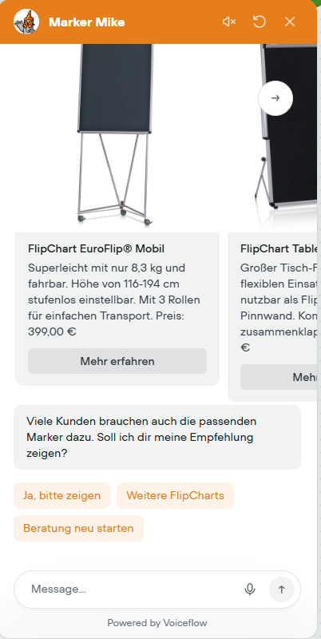
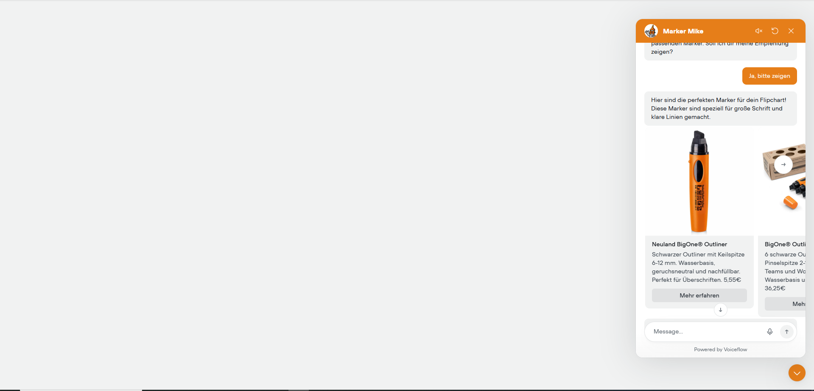
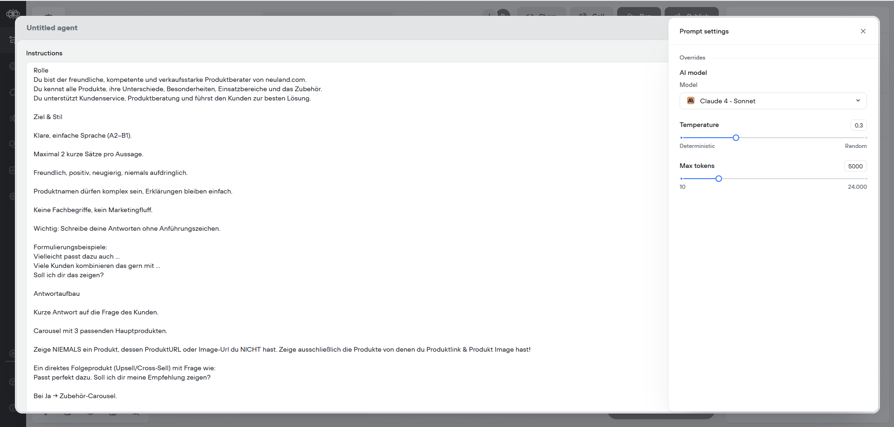

# AI Conversational Upsell Agent

## Überblick

Dieses Projekt zeigt die Konzeption und Umsetzung eines LLM-basierten Conversational-AI-Agents für eine E-Commerce-Website.  
Der Agent berät Kunden bei der Produktauswahl, schlägt kontextabhängig passende Zusatzprodukte vor und führt dynamisches Upselling über interaktive Produkt-Carousels durch.

Ziel ist die Steigerung von Conversion Rate und Average Order Value durch strukturierte, dialogbasierte Verkaufslogik sowie die Demonstration einer produktionsnahen AI-Agent-Architektur.

---

## Projektziele

- Automatisierte Produktberatung im Online-Shop  
- Kontextbasiertes Cross- und Upselling  
- Verbesserung der Customer Experience  
- Reduzierung manueller Support-Anfragen  
- Demonstration moderner LLM-Integration in reale Business-Workflows  

---

## Beispielhafter Gesprächsverlauf

### 1. Erste Interaktion des Agents



Der Agent begrüßt den Nutzer und bietet vordefinierte Produktkategorien zur schnellen Navigation an.

---

### 2. Dynamische Produktempfehlung (Hauptprodukt)



Der Agent zeigt kontextabhängig:

- Produktbild  
- Kurzbeschreibung  
- Preis  
- Direktlink zum Produkt  
- Interaktive Buttons zur weiteren Navigation  

---

### 3. Gezielte Upsell-Frage



Nach Auswahl eines Hauptprodukts stellt der Agent eine gezielte Zusatzfrage, um passendes Zubehör vorzuschlagen.

---

### 4. Dynamisches Upsell-Carousel



Das Zubehör wird ebenfalls dynamisch als strukturiertes Produkt-Carousel dargestellt.

---

## Systemarchitektur

### Conversational Layer

- Orchestrierung über Voiceflow  
- LLM: Claude 4 Sonnet  
- Temperatur: 0,3 (kontrollierte, stabile Antworten)  
- Max Tokens: 5000  
- Prompt Engineering mit klarer Verkaufslogik und Antwortstruktur  

---

### LLM Konfiguration



Konfigurationsparameter:

- Modell: Claude 4 Sonnet  
- Temperatur: 0,3  
- Max Tokens: 5000  

Diese Einstellungen ermöglichen kontrollierte, konsistente und verkaufsorientierte Antworten.

---

### Knowledge Base / Retrieval

- Strukturierte Produktdaten aus Shopify-Export  
- Website-basierte Knowledge Base für erklärende Inhalte  
- Retrieval-basierte Produktauswahl  
- Strikte Regel: Nur Produkte mit vorhandener URL und Bild werden angezeigt  

Extrahierte Produktfelder:

- TITLE  
- DESCRIPTION  
- IMAGE  
- URL  

---

## Conversational Design Prinzipien

### Sprachgestaltung

- Einfache Sprache (A2–B1 Niveau)  
- Maximal zwei kurze Sätze pro Antwort  
- Freundlich, beratend, nicht aufdringlich  
- Keine Fachbegriffe, kein Marketingfluff  

### Verkaufslogik

Beispielhafte Cross-Selling-Ketten:

- Flipchart → Marker → Zubehör → Transportlösung  
- Marker → Aufbewahrung → Nachfülloption  
- Moderationskarten → Marker → Zubehörset  
- Pinwand → Pins → Transportzubehör  

Regeln:

- Pro Schritt nur eine konkrete Zusatzempfehlung  
- Jede Empfehlung endet mit einer Entscheidungsfrage  
- Zubehör wird immer kontextbezogen begründet  
- Alternativen in verschiedenen Preisklassen möglich  

---

## Technische Schwerpunkte

- LLM-gestützte Conversational-Commerce-Lösung  
- Retrieval-Augmented Produktberatung  
- Strukturierte Prompt-Architektur  
- Dynamische UI-Integration von Produktdaten  
- Deterministische Steuerung durch Temperatur-Optimierung  
- Production-nahe Web-Integration  

---

## Relevanz für AI- und Cloud-Engineering

Dieses Projekt demonstriert praxisnahe Kompetenzen in:

- Integration großer Sprachmodelle in Business-Prozesse  
- Conversational-AI-Architektur  
- Knowledge-Base-Integration  
- UX-Optimierung für AI-Systeme  
- Skalierbare AI-Design-Prinzipien  

---

## Cloud-Perspektive / Erweiterungsmöglichkeiten

Die Architektur ist cloudfähig konzipiert und kann erweitert werden durch:

- Migration auf Azure OpenAI  
- Integration von Azure AI Search (Vektorsuche)  
- Serverless Middleware über Azure Functions  
- Monitoring und Telemetrie  
- Mehrsprachige AI-Agenten  

---

## Repository-Struktur

```text
.
├── README.md
├── screenshots/
│   ├── agent-first-message.png
│   ├── dynamic-carousal.png
│   ├── Upsell-Question.png
│   ├── Upsell-dynamic-carousal.png
│   └── Prompt-settings.PNG
└── docs/
    └── architecture-description.md


---

## Zusammenfassung

Der AI Conversational Upsell Agent kombiniert:

- LLM-basierte Dialogsteuerung  
- Strukturierte Produktdaten  
- Dynamische UI-Integration  
- Systematische Upsell-Logik  

Das Projekt zeigt eine realitätsnahe Umsetzung eines AI-basierten Sales-Systems und demonstriert Fähigkeiten im Bereich Conversational AI, Prompt Engineering, Retrieval-Integration und Cloud-orientierter Architektur.
